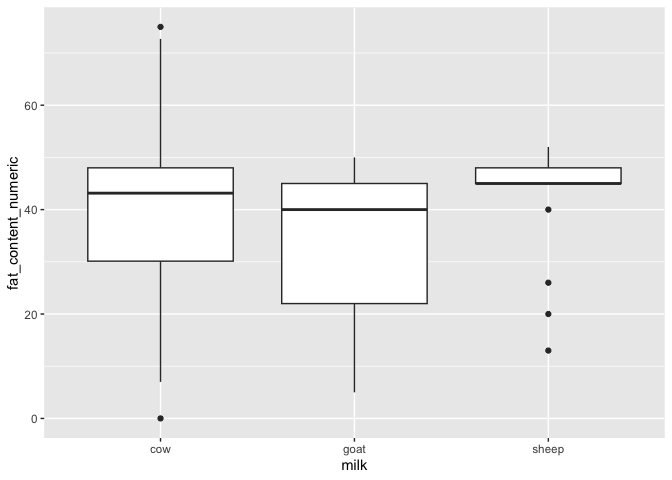
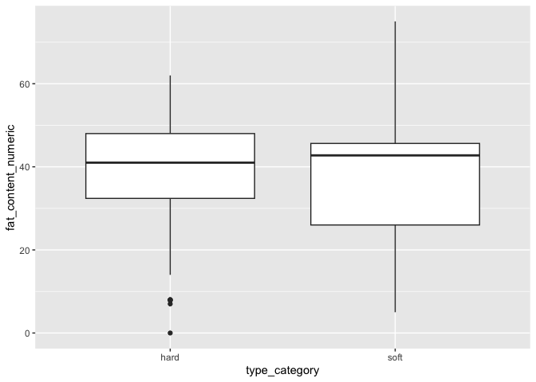

<!-- README.md is generated from README.Rmd. Please edit that file -->

# PCCTC Tidy Tuesday event

This is a fun little PCCTC data science team exercise in which we all
took 90 minutes to tackle a previous Tidy Tuesday challenge. Here’s my
entry that I stitched together in that rush.

------------------------------------------------------------------------

Packages.

``` r
library(tidyverse)
```

Data.

``` r
cheeses <- read_csv(
  'https://raw.githubusercontent.com/rfordatascience/tidytuesday/main/data/2024/2024-06-04/cheeses.csv'
)
#> Rows: 1187 Columns: 19
#> ── Column specification ────────────────────────────────────────────────────────
#> Delimiter: ","
#> chr (17): cheese, url, milk, country, region, family, type, fat_content, cal...
#> lgl  (2): vegetarian, vegan
#> 
#> ℹ Use `spec()` to retrieve the full column specification for this data.
#> ℹ Specify the column types or set `show_col_types = FALSE` to quiet this message.
```

From the tidy tuesday readme:

> 248 cheeses have listed fat content. Is there a relationship between
> fat content and cheese type? What about texture, flavor, or aroma?

Let’s start by looking at the fat content column, which needs some help
to become numeric.

``` r
# needs repair to be numeric
cheeses |>
  count(fat_content)
#> # A tibble: 86 × 2
#>    fat_content     n
#>    <chr>       <int>
#>  1 0 g/100g        1
#>  2 10%             1
#>  3 11%             1
#>  4 12%             5
#>  5 13%             1
#>  6 14 g/100g       1
#>  7 14%             3
#>  8 15%             1
#>  9 15-25%          1
#> 10 17%             1
#> # ℹ 76 more rows

# replace ranges with mean and strip %
cheeses <- cheeses |>
  mutate(
    fat_content_numeric = case_when(
      str_detect(fat_content, "^[0-9]+-[0-9]+%$") ~ {
        nums <- str_match(fat_content, "^([0-9]+)-([0-9]+)%$")
        rowMeans(cbind(as.numeric(nums[,2]), as.numeric(nums[,3])), na.rm = TRUE)
      },
      TRUE ~ as.numeric(str_extract(fat_content, "[0-9]+(\\.[0-9]+)?"))
    )
  )

# check that it worked
cheeses |>
  select(fat_content, fat_content_numeric) |>
  distinct() |>
  arrange(fat_content_numeric) |> 
  head(20)
#> # A tibble: 20 × 2
#>    fat_content fat_content_numeric
#>    <chr>                     <dbl>
#>  1 0 g/100g                    0  
#>  2 5 g/100g                    5  
#>  3 7 g/100g                    7  
#>  4 7.8 g/100g                  7.8
#>  5 8%                          8  
#>  6 8 g/100g                    8  
#>  7 10%                        10  
#>  8 11%                        11  
#>  9 12%                        12  
#> 10 13%                        13  
#> 11 14%                        14  
#> 12 14 g/100g                  14  
#> 13 15%                        15  
#> 14 17%                        17  
#> 15 18.2 g/100g                18.2
#> 16 18.3 g/100g                18.3
#> 17 18.4 g/100g                18.4
#> 18 20%                        20  
#> 19 15-25%                     20  
#> 20 20.8 g/100g                20.8
```

Now cheese type.

``` r
# cheese name is not helpful: each row is unique
cheeses |> 
  count(n_distinct(cheese))
#> # A tibble: 1 × 2
#>   `n_distinct(cheese)`     n
#>                  <int> <int>
#> 1                 1187  1187

# subcategorizing by animal source could be interesting
cheeses |> 
  count(milk, sort = TRUE)
#> # A tibble: 22 × 2
#>    milk                 n
#>    <chr>            <int>
#>  1 cow                696
#>  2 goat               195
#>  3 sheep              128
#>  4 <NA>                36
#>  5 cow, goat           25
#>  6 cow, goat, sheep    21
#>  7 cow, sheep          21
#>  8 goat, sheep         21
#>  9 water buffalo       14
#> 10 plant-based          6
#> # ℹ 12 more rows
```

Any trend by source?

``` r
cheeses |> 
  filter(
    milk %in% c("cow", "goat", "sheep"),
    !is.na(fat_content_numeric)
  ) |> 
  ggplot(aes(x = milk, y = fat_content_numeric)) +
  geom_boxplot()
```

<!-- -->

Moving on to cheese type.

``` r
# these are silly, just make hard or soft
cheeses |> 
  count(type, sort = TRUE)
#> # A tibble: 85 × 2
#>    type                    n
#>    <chr>               <int>
#>  1 semi-hard, artisan    133
#>  2 hard, artisan         121
#>  3 semi-soft, artisan    117
#>  4 soft, artisan          99
#>  5 soft                   90
#>  6 hard                   75
#>  7 semi-hard              70
#>  8 semi-soft              56
#>  9 soft, soft-ripened     51
#> 10 fresh soft, artisan    38
#> # ℹ 75 more rows

cheeses <- cheeses |>
  mutate(
    type_category = case_when(
      str_detect(type, regex("hard|firm", ignore_case = TRUE)) ~ "hard",
      str_detect(type, regex("soft", ignore_case = TRUE)) ~ "soft",
      TRUE ~ NA_character_
    )
  )

cheeses |>
  select(type, type_category) |>
  distinct() |>
  head(20)
#> # A tibble: 20 × 2
#>    type                       type_category
#>    <chr>                      <chr>        
#>  1 semi-soft                  soft         
#>  2 semi-hard, artisan         hard         
#>  3 semi-hard                  hard         
#>  4 semi-soft, artisan, brined soft         
#>  5 soft, artisan              soft         
#>  6 hard, artisan              hard         
#>  7 soft, soft-ripened         soft         
#>  8 soft, brined               soft         
#>  9 semi-soft, blue-veined     soft         
#> 10 soft                       soft         
#> 11 firm, artisan              hard         
#> 12 hard                       hard         
#> 13 semi-soft, artisan         soft         
#> 14 semi-soft, smear-ripened   soft         
#> 15 soft, semi-soft            soft         
#> 16 fresh soft                 soft         
#> 17 soft, semi-soft, organic   soft         
#> 18 firm                       hard         
#> 19 fresh soft, artisan        soft         
#> 20 hard, smear-ripened        hard
```

Any trend by type?

``` r
cheeses |> 
  filter(
    !is.na(type_category),
    !is.na(fat_content_numeric)
  ) |> 
  ggplot(aes(x = type_category, y = fat_content_numeric)) +
  geom_boxplot()
```

<!-- -->
